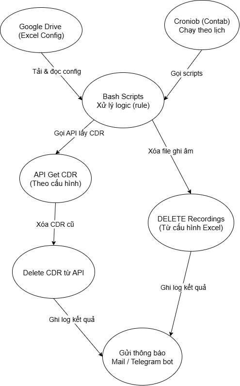

# Tự động xóa ghi âm và CDR từ danh sách Google Sheet

## Giới thiệu
Hệ thống này được thiết kế để **tự động xóa ghi âm** và **CDR** của các máy ảo (VM) dựa trên danh sách cấu hình được lưu trên **Google Sheets** hoặc file Excel.  
Cơ chế này giúp:
- Loại bỏ thao tác thủ công (manual delete).
- Giảm rủi ro sai sót khi vận hành.
- Tiết kiệm thời gian và tài nguyên lưu trữ.

---

## Luồng hoạt động


### Mô tả luồng
1. **Crontab** khởi chạy script shell định kỳ (ví dụ: 03:00 hàng ngày).
2. Script **tải danh sách tenant từ Google Sheets** (xuất sang CSV).
3. Đọc từng dòng để lấy thông tin tenant, UUID routing, thời gian xóa.
4. Xóa ghi âm cũ trong thư mục `/usr/local/freeswitch/recordings/<tenant>/archive/...`.
5. Gọi API ElasticSearch `_delete_by_query` để xóa dữ liệu CDR theo `from` - `to` và `_routing`.
6. Ghi log kết quả và gửi thông báo nếu cần.

---

## Cấu trúc file Google Sheet / Excel

Tên file ví dụ: **delete_cdr_schedule.xlsx**

| STT | Tenant Name | Routing UUID | From Datetime         | To Datetime           | Index UUID       | API URL                   | Note |
|-----|-------------|--------------|-----------------------|-----------------------|------------------|---------------------------|------|
| 1   | tenant1     | tenant1_a7843225-8806-4e3f-b183-9df24fe6b68f | 2024-07-01 00:00:00 | 2024-08-31 23:00:00 | cdr_index_2024  | http://10.10.10.5:9200    | Xóa dữ liệu 2 tháng |
| 2   | tenant2     | tenant2_b1523421-8806-4e3f-b183-9df24fe6b68f | 2024-06-01 00:00:00 | 2024-06-30 23:00:00 | cdr_index_2024  | http://10.10.10.5:9200    | Xóa tháng 6 |

### Giải thích:
- **Routing UUID** → giá trị `_routing` trong API.
- **From Datetime** và **To Datetime** → khoảng thời gian xóa.
- **Index UUID** → index ElasticSearch cần xóa.
- **API URL** → `http://ip:port` của ElasticSearch.
- **Note** → ghi chú cho quản trị viên.

---

## Script mẫu (phiên bản nâng cao, hỗ trợ API `_delete`)

```bash
#!/bin/bash
# ========================
# Script: auto_clear_records_cdr.sh
# Mục tiêu: Xóa ghi âm + CDR dựa trên danh sách Google Sheet/Excel
# ========================

GOOGLE_SHEET_CSV_URL="https://docs.google.com/spreadsheets/d/<ID>/export?format=csv"
RECORDINGS_BASE="/usr/local/freeswitch/recordings"
LOG_FILE="/var/log/auto_clear_records.log"

# Tải danh sách CSV từ Google Sheets
curl -sL "$GOOGLE_SHEET_CSV_URL" -o /tmp/tenant_list.csv

# Bỏ dòng tiêu đề và đọc từng dòng
tail -n +2 /tmp/tenant_list.csv | while IFS=',' read -r TENANT_NAME ROUTING_UUID FROM_DATETIME TO_DATETIME INDEX_UUID API_URL NOTE
do
    echo "[$(date)] Xử lý tenant: $TENANT_NAME ($ROUTING_UUID)" | tee -a "$LOG_FILE"

    # Xóa ghi âm cũ hơn FROM_DATETIME (tính theo ngày)
    if [ -d "$RECORDINGS_BASE/$TENANT_NAME/archive" ]; then
        echo " - Xóa ghi âm cũ hơn $(date -d "$FROM_DATETIME" +%s)" | tee -a "$LOG_FILE"
        find "$RECORDINGS_BASE/$TENANT_NAME/archive" -type f ! -newermt "$FROM_DATETIME" -exec rm -f {} \;
    else
        echo " - Không tìm thấy thư mục recordings cho $TENANT_NAME" | tee -a "$LOG_FILE"
    fi

    # Gọi API xóa CDR trên ElasticSearch
    DELETE_URL="$API_URL/$INDEX_UUID/_delete_by_query"
    JSON_BODY=$(cat <<EOF
{
  "track_total_hits": true,
  "query": {
    "bool": {
      "filter": [
        {
          "range": {
            "start_stamp": {
              "from": "$FROM_DATETIME",
              "to": "$TO_DATETIME",
              "include_lower": true,
              "include_upper": true
            }
          }
        },
        {
          "terms": {
            "_routing": ["$ROUTING_UUID"]
          }
        }
      ]
    }
  }
}
EOF
)
    echo " - Gọi API xóa CDR: $DELETE_URL" | tee -a "$LOG_FILE"
    curl -s -X POST "$DELETE_URL" \
         -H "Content-Type: application/json" \
         -d "$JSON_BODY" >> "$LOG_FILE"

    echo "" >> "$LOG_FILE"
done

echo "[$(date)] Hoàn tất quá trình" | tee -a "$LOG_FILE"
````

---

## Cài đặt crontab

Ví dụ, chạy script lúc **03:00** hàng ngày:

```bash
0 3 * * * /bin/bash /home/user/scripts/auto_clear_records_cdr.sh
```

---

## Yêu cầu

* Máy chủ cài `curl`, `find`
* Quyền truy cập đọc/ghi thư mục recordings
* API ElasticSearch `_delete_by_query` hoạt động
* File Google Sheet hoặc Excel xuất được CSV

---

## Tác giả

* **Người thực hiện:** Phạm Minh Thảo
* **Ngày:** 2025-08-11

```
