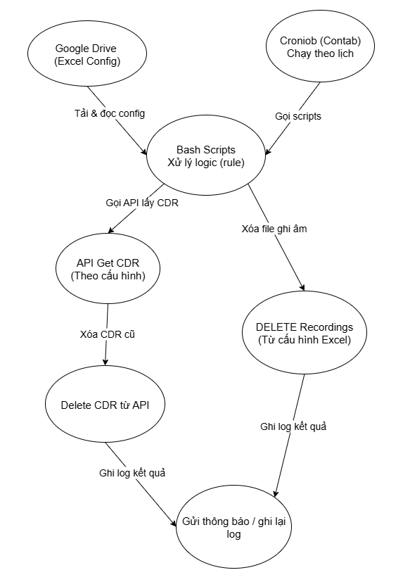

# Tự động xóa ghi âm và CDR từ danh sách Google Sheet

## 1. Giới thiệu

Hệ thống này được thiết kế để **tự động xóa ghi âm** (recordings) và/hoặc **CDR** (Call Detail Records) của các máy ảo (VM) dựa trên danh sách cấu hình lưu trên **Google Sheets** hoặc file CSV.

Điểm nâng cấp mới:

* Có thể chọn **hành động xóa**: chỉ recordings, chỉ CDR, cả hai, hoặc bỏ qua.
* Hỗ trợ thông tin `CONTEXT_TYPE` và `AUTH` riêng cho từng tenant.
* Có chế độ **`--dry-run`** để kiểm tra trước khi xóa.

---

## 2. Lợi ích

* Giảm thao tác thủ công.
* Giảm rủi ro sai sót khi vận hành.
* Tiết kiệm thời gian và tài nguyên lưu trữ.
* Cho phép linh hoạt tùy chọn hành động xóa.

---

## 3. Lưu ý về dữ liệu CDR

Trong hệ thống Autocall/FreeSWITCH:

* **CDR** được lưu ở:

  1. **Database (DB)** — thường là PostgreSQL/MySQL.
  2. **ElasticSearch (ES)** — phục vụ log & tìm kiếm nhanh.
* Script sẽ xóa:

  * **Recordings** trong thư mục `/usr/local/freeswitch/recordings/<tenant>/archive/`.
  * **CDR trên ES** qua API `_delete_by_query`.
  * **CDR trong DB** qua lệnh `DELETE`.

---

## 4. Luồng hoạt động



**Mô tả:**

1. Crontab chạy script vào giờ định sẵn.
2. Script tải danh sách tenant từ Google Sheets (xuất CSV).
3. Đọc từng dòng: tenant, thời gian xóa, thông tin DB, ES, và hành động xóa (`Action`).
4. Thực hiện xóa recordings / CDR / cả hai theo tùy chọn.
5. Ghi log kết quả.

---

## 5. Cấu trúc Google Sheet / CSV

**Ví dụ:**

| STT | Tenant Name | Routing UUID                                  | From Datetime       | To Datetime         | Alias Index      | API URL                                          | CONTEXT\_TYPE    | AUTH                       | DB Host    | DB Port | DB Name   | DB User   | DB Pass | Action     | Note                |
| --- | ----------- | --------------------------------------------- | ------------------- | ------------------- | ---------------- | ------------------------------------------------ | ---------------- | -------------------------- | ---------- | ------- | --------- | --------- | ------- | ---------- | ------------------- |
| 1   | tenant1@tenant.com     | tenant1\_a7843225-8806-4e3f-b183-9df24fe6b68f | 2024-07-01 00:00:00 | 2024-08-31 23:59:59 | tenant1\_a7843225-8806-4e3f-b183-9df24fe6b68f | [http://10.10.10.5:9200](http://10.10.10.5:9200) | application/json | Basic YWRtaW46cGFzc3dvcmQ= | 10.10.10.2 | 5432    | fusionpbx | fusionpbx | pass123 | both       | Xóa dữ liệu 2 tháng |
| 2   | tenant2@tenant.com      | tenant2\_b1523421-8806-4e3f-b183-9df24fe6b68f | 2024-06-01 00:00:00 | 2024-06-30 23:59:59 | tenant2\_a7843225-8806-4e3f-b183-9df24fe6b68f | [http://10.10.10.5:9200](http://10.10.10.5:9200) | application/json | Bearer abc123              | 10.10.10.3 | 3306    | autocall  | autocall  | pass456 | recordings | Chỉ xóa file ghi âm |


**Giải thích các cột:**

* `STT`
  Số thứ tự trong danh sách, dùng để theo dõi, không ảnh hưởng đến script.

* `Tenant Name`
  Tên tenant trên hệ thống, cũng là tên thư mục chứa recordings: `/usr/local/freeswitch/recordings/<Tenant Name>/archive/`.

* `Routing UUID`
  Giá trị `_routing` dùng để lọc khi xóa CDR trên ElasticSearch.

* `From Datetime`
  Thời điểm bắt đầu của khoảng thời gian cần xóa dữ liệu, định dạng `YYYY-MM-DD HH:MM:SS`.

* `To Datetime`
  Thời điểm kết thúc của khoảng thời gian cần xóa dữ liệu, định dạng `YYYY-MM-DD HH:MM:SS`.

* `Index UUID`
  Tên index ElasticSearch chứa dữ liệu CDR cần xóa.

* `API URL`
  Địa chỉ API ElasticSearch, ví dụ: `http://10.10.10.5:9200`.

* `CONTEXT_TYPE`
  Content-Type header khi gọi API ElasticSearch, ví dụ: `application/json`.

* `AUTH`
  Thông tin Authorization header khi gọi API ElasticSearch, ví dụ: `Basic YWRtaW46cGFzc3dvcmQ=` hoặc `Bearer <token>`. Có thể để trống nếu không cần.

* `DB Host`
  Địa chỉ IP hoặc hostname của database chứa CDR.

* `DB Port`
  Cổng kết nối đến database, ví dụ: `5432` cho PostgreSQL, `3306` cho MySQL.

* `DB Name`
  Tên database chứa bảng CDR (thường bảng `v_xml_cdr`).

* `DB User`
  Tài khoản database có quyền xóa CDR.

* `DB Pass`
  Mật khẩu của tài khoản database.

* `Action`
  Hành động muốn thực hiện với tenant:

  * `recordings` → chỉ xóa file ghi âm.
  * `cdr` → chỉ xóa CDR (ElasticSearch + DB).
  * `both` → xóa cả hai (mặc định nếu để trống).
  * `none` → bỏ qua tenant này.

* `Note`
  Ghi chú cho quản trị viên, ví dụ: “Xóa dữ liệu 2 tháng”.

---

## 6. Cài đặt script

**File script**: `auto_clear_records_cdr.sh`
Quyền thực thi:

```bash
chmod +x auto_clear_records_cdr.sh
```

**Nội dung script mẫu (auto\_clear\_records\_cdr.sh):**

```bash
#!/bin/bash
# ========================
# Script: auto_clear_records_cdr.sh
# Mô tả: Tự động xóa recordings và/hoặc CDR theo danh sách CSV từ Google Sheets
# Usage: /bin/bash auto_clear_records_cdr.sh [--dry-run]
# ========================

set -o pipefail

DRY_RUN=0
if [[ "$1" == "--dry-run" ]]; then
  DRY_RUN=1
  echo "=== DRY RUN mode: không thực thi xóa ==="
fi

GOOGLE_SHEET_CSV_URL="https://docs.google.com/spreadsheets/d/<ID>/export?format=csv"
RECORDINGS_BASE="/usr/local/freeswitch/recordings"
LOG_FILE="/var/log/auto_clear_records.log"
TMP_CSV="/tmp/tenant_list.csv"

# Tải CSV từ Google Sheets
curl -sL "$GOOGLE_SHEET_CSV_URL" -o "$TMP_CSV"
if [[ $? -ne 0 || ! -s "$TMP_CSV" ]]; then
  echo "[$(date)] ERROR: Không tải được CSV từ Google Sheets" | tee -a "$LOG_FILE"
  exit 1
fi

# Bỏ dòng header và đọc từng dòng
tail -n +2 "$TMP_CSV" | while IFS=',' read -r STT TENANT_NAME ROUTING_UUID FROM_DATETIME TO_DATETIME INDEX_UUID API_URL CONTEXT_TYPE AUTH DB_HOST DB_PORT DB_NAME DB_USER DB_PASS ACTION NOTE
do
    # Hàm trim space
    trim() { echo "$1" | sed -e 's/^[[:space:]]*//' -e 's/[[:space:]]*$//'; }
    TENANT_NAME=$(trim "$TENANT_NAME")
    ROUTING_UUID=$(trim "$ROUTING_UUID")
    FROM_DATETIME=$(trim "$FROM_DATETIME")
    TO_DATETIME=$(trim "$TO_DATETIME")
    INDEX_UUID=$(trim "$INDEX_UUID")
    API_URL=$(trim "$API_URL")
    CONTEXT_TYPE=$(trim "$CONTEXT_TYPE")
    AUTH=$(trim "$AUTH")
    DB_HOST=$(trim "$DB_HOST")
    DB_PORT=$(trim "$DB_PORT")
    DB_NAME=$(trim "$DB_NAME")
    DB_USER=$(trim "$DB_USER")
    DB_PASS=$(trim "$DB_PASS")
    ACTION=$(echo "$(trim "$ACTION")" | tr '[:upper:]' '[:lower:]')
    NOTE=$(trim "$NOTE")

    # Mặc định nếu action trống thì là both
    if [[ -z "$ACTION" ]]; then
      ACTION="both"
    fi

    echo "[$(date)] Xử lý tenant: $TENANT_NAME | Action: $ACTION" | tee -a "$LOG_FILE"

    # Xóa recordings
    if [[ "$ACTION" == "recordings" || "$ACTION" == "both" ]]; then
      RECORD_DIR="$RECORDINGS_BASE/$TENANT_NAME/archive"
      if [ -d "$RECORD_DIR" ]; then
        echo " - [Recordings] Xóa file ghi âm cũ hơn $FROM_DATETIME tại $RECORD_DIR" | tee -a "$LOG_FILE"
        if [[ $DRY_RUN -eq 1 ]]; then
          find "$RECORD_DIR" -type f ! -newermt "$FROM_DATETIME" -print | tee -a "$LOG_FILE"
        else
          find "$RECORD_DIR" -type f ! -newermt "$FROM_DATETIME" -print -exec rm -f {} \; >> "$LOG_FILE" 2>&1
          echo "   -> Đã xóa xong." | tee -a "$LOG_FILE"
        fi
      else
        echo " - [Recordings] Thư mục không tồn tại: $RECORD_DIR" | tee -a "$LOG_FILE"
      fi
    else
      echo " - [Recordings] Bỏ qua (action=$ACTION)" | tee -a "$LOG_FILE"
    fi

    # Xóa CDR ElasticSearch
    if [[ "$ACTION" == "cdr" || "$ACTION" == "both" ]]; then
      if [[ -z "$API_URL" || -z "$INDEX_UUID" ]]; then
        echo " - [ES] Bỏ qua: thiếu API_URL hoặc Index UUID" | tee -a "$LOG_FILE"
      else
        DELETE_URL="$API_URL/$INDEX_UUID/_delete_by_query"
        if [[ -z "$CONTEXT_TYPE" ]]; then CONTEXT_TYPE="application/json"; fi
        # Tạo JSON body
        JSON_BODY=$(cat <<EOF
{
  "track_total_hits": true,
  "query": {
    "bool": {
      "filter": [
        {
          "range": {
            "start_stamp": {
              "from": "$FROM_DATETIME",
              "to": "$TO_DATETIME",
              "include_lower": true,
              "include_upper": true
            }
          }
        }$( if [[ -n "$ROUTING_UUID" ]]; then echo ', { "terms": { "_routing": ["'"$ROUTING_UUID"'"] } }'; fi )
      ]
    }
  }
}
EOF
)
        echo " - [ES] Gửi API xóa dữ liệu CDR tới $DELETE_URL" | tee -a "$LOG_FILE"
        if [[ $DRY_RUN -eq 1 ]]; then
          echo "   DRY RUN: body:" | tee -a "$LOG_FILE"
          echo "$JSON_BODY" | tee -a "$LOG_FILE"
        else
          if [[ -n "$AUTH" ]]; then
            curl -s -X POST "$DELETE_URL" -H "Content-Type: $CONTEXT_TYPE" -H "Authorization: $AUTH" -d "$JSON_BODY" >> "$LOG_FILE" 2>&1 || echo "   [ES] Lỗi khi gọi API" | tee -a "$LOG_FILE"
          else
            curl -s -X POST "$DELETE_URL" -H "Content-Type: $CONTEXT_TYPE" -d "$JSON_BODY" >> "$LOG_FILE" 2>&1 || echo "   [ES] Lỗi khi gọi API" | tee -a "$LOG_FILE"
          fi
          echo "   -> Yêu cầu xóa CDR đã gửi." | tee -a "$LOG_FILE"
        fi
      fi
    else
      echo " - [ES] Bỏ qua (action=$ACTION)" | tee -a "$LOG_FILE"
    fi

    # Xóa CDR Database
    if [[ "$ACTION" == "cdr" || "$ACTION" == "both" ]]; then
      if [[ -z "$DB_HOST" || -z "$DB_NAME" || -z "$DB_USER" ]]; then
        echo " - [DB] Bỏ qua: thiếu thông tin DB" | tee -a "$LOG_FILE"
      else
        echo " - [DB] Xóa dữ liệu CDR trong DB $DB_NAME tại $DB_HOST:$DB_PORT" | tee -a "$LOG_FILE"
        SQL="DELETE FROM v_xml_cdr WHERE start_stamp BETWEEN '$FROM_DATETIME' AND '$TO_DATETIME' AND context = '$TENANT_NAME';"
        if [[ $DRY_RUN -eq 1 ]]; then
          echo "   DRY RUN: SQL -> $SQL" | tee -a "$LOG_FILE"
        else
          if [[ "$DB_PORT" == "5432" ]]; then
            PGPASSWORD="$DB_PASS" psql -h "$DB_HOST" -p "$DB_PORT" -U "$DB_USER" -d "$DB_NAME" -c "$SQL" >> "$LOG_FILE" 2>&1 || echo "   [DB] Lỗi khi xóa trên PostgreSQL" | tee -a "$LOG_FILE"
          else
            mysql -h "$DB_HOST" -P "$DB_PORT" -u "$DB_USER" -p"$DB_PASS" "$DB_NAME" -e "$SQL" >> "$LOG_FILE" 2>&1 || echo "   [DB] Lỗi khi xóa trên MySQL" | tee -a "$LOG_FILE"
          fi
          echo "   -> Lệnh xóa DB đã chạy." | tee -a "$LOG_FILE"
        fi
      fi
    else
      echo " - [DB] Bỏ qua (action=$ACTION)" | tee -a "$LOG_FILE"
    fi

    echo "" >> "$LOG_FILE"

done

rm -f "$TMP_CSV"

echo "[$(date)] Hoàn tất quá trình" | tee -a "$LOG_FILE"
```

---

**Chạy thử (không xóa thật):**

```bash
/bin/bash auto_clear_records_cdr.sh --dry-run
```

**Chạy thật:**

```bash
/bin/bash auto_clear_records_cdr.sh
```

---

## 7. Cài đặt crontab

Chạy mỗi ngày lúc 03:00 sáng:

```bash
0 3 * * * /bin/bash /home/user/scripts/auto_clear_records_cdr.sh
```

---

## 8. Yêu cầu hệ thống

* Máy chủ cài:

  * `curl`, `find`, `psql` (PostgreSQL), `mysql` (MySQL).
* Quyền đọc/ghi thư mục recordings.
* API ElasticSearch `_delete_by_query` hoạt động.
* Kết nối DB thành công.
* **Backup dữ liệu trước khi xóa**.

---

## 9. Lưu ý an toàn

* Luôn chạy `--dry-run` trước khi triển khai thật.
* Backup DB và recordings.
* Giới hạn quyền user DB/API để giảm rủi ro.
* Kiểm tra định kỳ log `/var/log/auto_clear_records.log`.

---

## 10. Liên hệ & hỗ trợ

Người phụ trách script: \[Phạm Minh Thảo]
Email: \[[minhthaopham230104@gmail.com](mailto:minhthaopham230104@gmail.com)]

---
